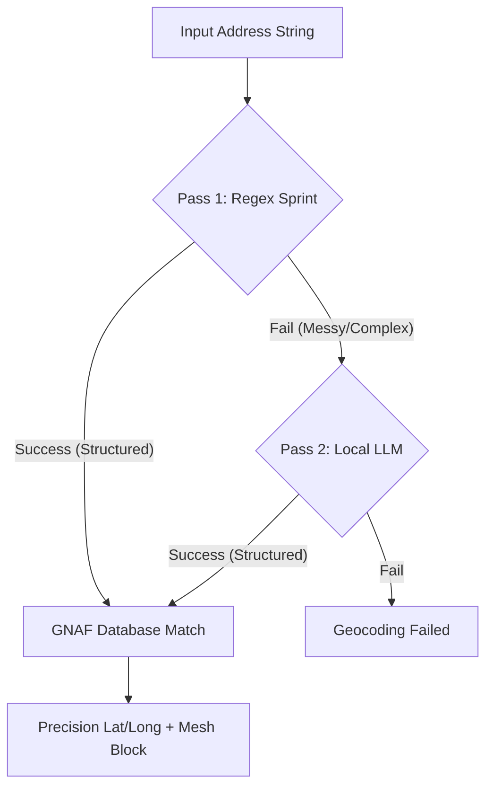

# GNAFER: High-Performance Australian Geocoder

GNAFER is a local-first geocoding pipeline designed for high-precision Australian address resolution. It leverages the full **GNAF CORE** dataset (15.8M rows) combined with a hybrid **Two-Pass matching engine** (Regex + LocalLLM) to achieve sub-unit accuracy at scale.

---

## 🗺️ The Challenge: Real-World Australian Geocoding

Geocoding sounds straightforward until you're dealing with real-world Australian addresses. Irregular formats, and inconsistent inputs mean a raw address string often fails before it ever hits a traditional geocoding API.

GNAFER was built to solve this by treating address standardisation as a sequential pipeline:



### 📍 Example 1: The Regex Sprint (Fast & Deterministic)
**Input**: `"1/255 George Street, Sydney"`
- **Action**: Regex identifies `Unit 1`, `Number 255`, `Street GEORGE`, `Type ST`.
- **Result**: Instant match in the GNAF database (~5ms).

### 🤖 Example 2: The AI Fallback (Robust & Intelligent)
**Input**: `"Level 5, 10 Main Rd, Melbourne"`
- **Action**: Regex fails to handle "Level 5" prefix.
- **AI Refinement**: Local `qwen2.5:1.5b` parses the string into a structured object, identifying the level and unit correctly.
- **Result**: Successful match that would have otherwise failed.

The result is a reliable geocoder that degrades gracefully rather than failing silently—designed specifically for Australian spatial data, property datasets, and high-volume address matching.

---

## 🚀 Key Features

- **Sub-Unit Precision**: Hierarchical matching logic that resolves down to Unit/Shop/Level (e.g., "Unit 5, Level 2...").
- **Mesh Block (mb_code) Support**: Returns the ABS Mesh Block code for every successful match, enabling direct linkage to Census data.
- **Two-Pass Hybrid Engine**:
    - **Pass 1 (Regex Sprint)**: Instant, rule-based geocoding for 80%+ of standard addresses (~2,500 rows/sec).
    - **Pass 2 (Async LLM Refinement)**: Concurrent AI refinement using `qwen2.5:1.5b` for complex or messy addresses.
- **FastAPI Microservice**: Integrated REST API with single and background-batch endpoints.
- **Observability Stack**:
    - **Logtail**: Remote structured JSON logging and session tracking.
    - **Healthchecks.io**: Heartbeat monitoring and crash alerting (with ntfy integration).
- **Type-Aware Matching**: Intelligent handling of 50+ Australian street types and abbreviations (e.g., "Pde", "Cct", "St").
- **Production Hardened**: Pre-configured resource limits, Docker log rotation, and automated test suite.

---

## 🛠️ Tech Stack

- **Logic**: Python 3.12+ (FastAPI, Pydantic, Asyncio)
- **Database**: PostgreSQL 16 + `pg_trgm` (Fuzzy Matching)
- **AI/LLM**: Ollama (`qwen2.5:1.5b`)
- **Package Manager**: `uv` (Deterministic dependencies)
- **Containerization**: Docker & Docker Compose
- **Testing**: `pytest` with `httpx` (API contract testing)

---

## 📦 Setup & Installation

### 1. Prerequisites
- Docker & Docker Compose
- [Ollama](https://ollama.com/) (Running on the host for GPU acceleration)
- Python 3.12+

### 2. Infrastructure
```bash
# Install dependencies (including dev tools)
make setup

# Start the PostgreSQL container
make start

# Pull the required LLM model
ollama pull qwen2.5:1.5b

# Check status of components
make status
```

### 3. Data Ingestion
Place your `GNAF_CORE.psv` file in the `data/` directory and run:
```bash
make db-init
```
*Note: This processes ~15.8 million rows. Use `make db-status` to monitor progress.*

---

## 🖥️ Usage

### REST API (Recommended for Microservices)
Launch the server:
```bash
make serve
```

#### Single Address Geocode
**POST** `/geocode`
```bash
curl -X POST http://localhost:8000/geocode?min_confidence=0.8 \
     -H "Content-Type: application/json" \
     -d '{"address": "42/7 Weston St, Rosehill 2142"}'
```
*Filter low-quality matches using the optional `min_confidence` parameter.*

#### Batch Job (Background)
**POST** `/geocode/batch`
```bash
curl -X POST http://localhost:8000/geocode/batch \
     -H "Content-Type: application/json" \
     -d '{"addresses": ["1 George St, Sydney", "497 New South Head Rd, Double Bay"]}'
```
*Returns a `job_id`. Monitor progress via `GET /jobs/{job_id}` or stream partial results via `GET /jobs/{job_id}/results`.*

### CLI Batch Processing
For large file-based workloads:
```bash
make run
```
*Processes `input.txt` and generates `geocoded.csv`. Heartbeat signals are sent to Healthchecks.io.*

### Automated Testing
```bash
make test
```
*Runs the full suite of parser, matcher, and API contract tests.*

---

## 📋 Environment Configuration (`.env`)

| Variable | Description | Default |
| :--- | :--- | :--- |
| `DB_NAME` | PostgreSQL Database Name | `gnafer` |
| `OLLAMA_MODEL` | AI Model for Refinement | `qwen2.5:1.5b` |
| `LOGTAIL_TOKEN` | Remote Logging Token | (Optional) |
| `HEALTHCHECKS_UUID` | Heartbeat Monitoring UUID | (Optional) |

---

## 🛡️ License
MIT License. Created for high-performance Australian spatial data workloads.
