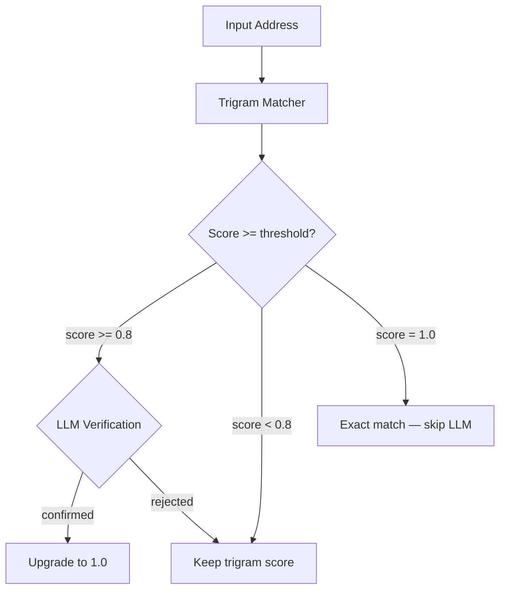

# GNAFER: High-Performance Australian Geocoder

GNAFER is a local-first geocoding pipeline for high-precision Australian address resolution. It matches free-text addresses against the full **GNAF CORE** dataset (15.8M rows) using **pg_trgm trigram similarity** with structural re-scoring, then optionally verifies near-matches through a local LLM.

---

## 🗺️ The Challenge: Real-World Australian Geocoding

Geocoding sounds straightforward until you're dealing with real-world Australian addresses. Irregular formats, building name prefixes, unit/lot variations, and street type abbreviations mean a raw address string rarely matches a canonical G-NAF label cleanly.

GNAFER solves this with a two-pass pipeline:



### How It Works

1. **Trigram Matching** — The input address is normalised and compared against G-NAF using PostgreSQL `pg_trgm` similarity. A three-stage fallback narrows candidates: street-level → suburb+postcode → full trigram. Each candidate is then structurally re-scored by comparing house numbers, unit/flat numbers, and lot numbers.

2. **LLM Verification** — Candidates scoring between the threshold (default `0.8`) and `1.0` are sent to a local Ollama model. The LLM answers a simple yes/no: "Are these the same physical address?" Confirmed matches are upgraded to `1.0`.

### Example

**Input**: `1704/45 Macquarie Street, Parramatta, NSW 2150`

- **Trigram match** finds the correct G-NAF record despite its `address_site_name` prefix inflating the label
- **Structural re-scoring** verifies `number_first=45`, `flat_number=1704` match the input
- **Result**: Score `1.0`, PID `GANSW705645045`

---

## 🚀 Key Features

- **Trigram Similarity Engine**: Three-stage fallback (street → suburb → full label) with `GREATEST()` to handle `address_site_name`/`building_name` prefixes
- **Structural Re-scoring**: Verifies house numbers, unit/flat numbers, lot numbers, and number ranges against G-NAF components
- **LLM Verification**: Optional local LLM pass to confirm near-matches (configurable threshold)
- **Parallel Batch Processing**: `ThreadedConnectionPool` + `ThreadPoolExecutor` for high-throughput batch matching
- **FastAPI Microservice**: REST API with single and background-batch endpoints
- **Observability**: Logtail structured logging + Healthchecks.io heartbeat monitoring
- **50+ Street Type Normalisation**: Expands abbreviations using the G-NAF Authority Code PSV

---

## 🛠️ Tech Stack

- **Logic**: Python 3.12+ (FastAPI, Pydantic, Asyncio)
- **Database**: PostgreSQL 16 + `pg_trgm` (Trigram Similarity)
- **AI/LLM**: Ollama (verification only, not parsing)
- **Package Manager**: `uv` (Deterministic dependencies)
- **Containerization**: Docker & Docker Compose
- **CI**: GitHub Actions (`pytest` on push)
- **Testing**: `pytest` with mocked DB and LLM

---

## 📦 Setup & Installation

### Prerequisites
- Docker & Docker Compose
- [Ollama](https://ollama.com/) running on the host (see [Architecture Note](#-architecture-note) below)
- Python 3.12+
- [uv](https://docs.astral.sh/uv/) package manager

### 🏗️ Architecture Note

GNAFER uses a **hybrid topology**: PostgreSQL runs in Docker, while the Python app and Ollama run on the host.

Ollama runs on the host (not in Docker) to enable **direct GPU access** for LLM inference. Containerising Ollama requires the NVIDIA Container Toolkit and adds latency — keeping it on the host is simpler and faster.

| Component | Runs | Why |
|:---|:---|:---|
| **PostgreSQL** | Docker container | Isolated, reproducible, easy to reset |
| **Python app** | Host (via `uv run`) | Direct access to filesystem and GPU-hosted Ollama |
| **Ollama** | Host | Needs GPU — `qwen2.5:1.5b` requires ~2GB VRAM |

#### Ollama Model Requirements

| Model | VRAM | Speed | Recommended For |
|:---|:---|:---|:---|
| `qwen2.5:1.5b` | ~2 GB | ~50 tokens/s | Default — fast batch verification |
| `qwen2.5:latest` (7B) | ~5 GB | ~15 tokens/s | Higher accuracy, slower throughput |

> 💡 If Ollama is unavailable, the pipeline **degrades gracefully** — trigram matching still works, only LLM verification is skipped.

### Quick Start

```bash
# 1. Install dependencies
make setup

# 2. Start PostgreSQL
make start

# 3. Pull the LLM model
ollama pull qwen2.5:latest

# 4. Place GNAF_CORE.psv in data/ and ingest
make db-init

# 5. Check all components are up
make status
```

> ⚠️ Data ingestion processes ~15.8 million rows. Monitor with `make db-status`.

---

## 🖥️ Usage

### REST API

```bash
make serve
```

#### Single Address

**POST** `/geocode`
```bash
curl -X POST http://localhost:8000/geocode \
     -H "Content-Type: application/json" \
     -d '{"address": "42/7 Weston St, Rosehill, NSW 2142"}'
```

#### Batch Job (Background)

**POST** `/geocode/batch`
```bash
curl -X POST http://localhost:8000/geocode/batch \
     -H "Content-Type: application/json" \
     -d '{"addresses": ["1 George St, Sydney, NSW 2000", "497 New South Head Rd, Double Bay, NSW 2028"]}'
```

Returns a `job_id`. Monitor via `GET /jobs/{job_id}`, fetch results via `GET /jobs/{job_id}/results`.

### CLI Batch Processing

Create an `input.txt` file with one address per line, then:

```bash
make run
```

Outputs `geocoded.csv` with match scores, PIDs, and LLM verification status.

### Testing

```bash
make test
```

---

## 📋 Environment Configuration (`.env`)

| Variable | Description | Default |
| :--- | :--- | :--- |
| `DB_USER` | PostgreSQL user | `postgres` |
| `DB_PASSWORD` | PostgreSQL password | `postgres` |
| `DB_NAME` | Database name | `gnafer` |
| `DB_HOST` | Database host | `localhost` |
| `DB_PORT` | Database port | `5432` |
| `OLLAMA_HOST` | Ollama server URL | `http://localhost:11434` |
| `TRIGRAM_WORKERS` | Parallel matching threads | `16` |
| `STREET_TYPES_PSV` | Path to street type authority file | `data/Authority_Code_STREET_TYPE_AUT_psv.psv` |
| `LLM_VERIFY_THRESHOLD` | Minimum trigram score to trigger LLM verification | `0.8` |
| `LLM_VERIFY_MODEL` | Ollama model for verification | `qwen2.5:1.5b` |
| `LOGTAIL_TOKEN` | Remote structured logging token | *(optional)* |
| `HEALTHCHECKS_UUID` | Heartbeat monitoring UUID | *(optional)* |
| `GNAF_CSV_PATH` | Path to GNAF CORE PSV for ingestion | `data/GNAF_CORE.psv` |

> ⚠️ Change `DB_USER`/`DB_PASSWORD` for any non-local deployment.

---

## 🛡️ License

MIT License. Created for high-performance Australian spatial data workloads.
