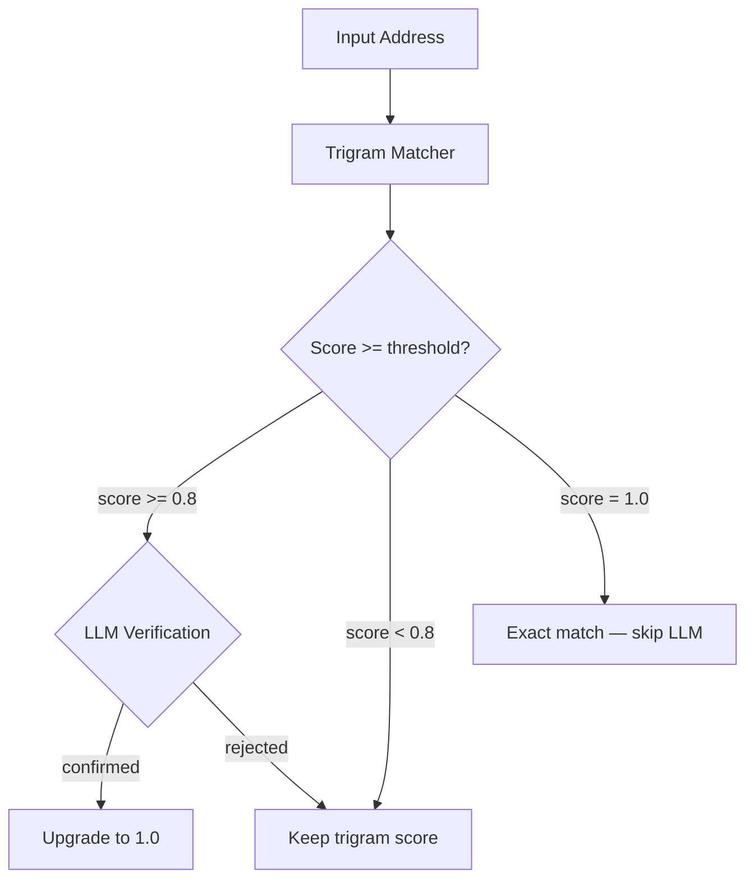

# GNAFER: High-Performance Australian Geocoder

GNAFER is a local-first geocoding pipeline for high-precision Australian address resolution. It matches free-text addresses against the full **G-NAF** dataset (15.8M addresses) using **pg_trgm trigram similarity** with structural re-scoring, then optionally verifies near-matches through a local LLM.

---

## 📖 Overview

### The Problem

Australian property and spatial data workflows depend on geocoding — converting a free-text address like `"1704/45 Macquarie St, Parramatta NSW 2150"` into a structured, validated record with latitude, longitude, and a canonical address PID. This sounds straightforward, but doing it accurately at scale with real-world Australian addresses is deceptively hard.

Existing solutions fall short:

- **Cloud geocoding APIs** (Google, HERE, Mapbox) charge per request and introduce latency. At scale — batch processing tens or hundreds of thousands of addresses — costs quickly become prohibitive. Furthermore, generic global models can fail to handle region-specific Australian address formats (like lot numbers and range matches) accurately.
- **Simple string matching** breaks down against real-world Australian addresses. Unit/lot formats (`3/45`, `UNIT 3 45`, `LOT 7`), building name prefixes (`MERITON SUITES 1704 45 MACQUARIE STREET`), 50+ street type abbreviations (`ST`, `RD`, `AVE`), and number ranges (`7-11`) mean a raw input string rarely matches a canonical G-NAF label cleanly.
- **Open-source parsers** (like libpostal) require complex C-compilation setups and still fall short on parsing non-standard Australian formats reliably. Because they only solve parsing, any errors in their decomposition propagate downstream, making subsequent database lookups and coordinate resolution highly inaccurate.

### What GNAFER Does

GNAFER is a **fully local, self-hosted geocoding engine** purpose-built for Australian addresses. It runs entirely on your own hardware — no API keys, no per-request charges, no data leaving your network.

It works by loading the complete [G-NAF (Geocoded National Address File)](https://data.gov.au/data/dataset/geocoded-national-address-file-g-naf) into PostgreSQL, then using a two-pass pipeline to match input addresses:

1. **Pass 1 — Trigram Matching**: PostgreSQL `pg_trgm` fuzzy similarity with a three-stage fallback (street-level → suburb+postcode → full label). Candidates are structurally re-scored by comparing house numbers, unit/flat numbers, lot numbers, and number ranges against the G-NAF components.

2. **Pass 2 — LLM Verification**: Near-matches (score between the threshold and 1.0, defaulting to `0.8` as configured by `LLM_VERIFY_THRESHOLD` in `.env`) are sent to a local Ollama model that answers a simple yes/no: *"Are these the same physical address?"* Confirmed matches are upgraded to 1.0.



### Why Trigrams + LLM?

Trigram similarity is fast and handles typos and abbreviations well, but it can't reason about whether `"1704/45 Macquarie St"` and `"MERITON SUITES UNIT 1704 45 MACQUARIE STREET"` are the same place. The structural re-scoring catches most of these cases, but for the remaining ambiguous candidates (scoring 0.8–0.99), a local LLM provides a semantic verification layer that pushes match accuracy higher — without the high cost of a cloud API.

### Examples

#### Example 1: Exact Match (Fast-path)
**Input**: `1704/45 Macquarie Street, Parramatta, NSW 2150`
- **Trigram match** finds the correct G-NAF record despite its `address_site_name` prefix inflating the label.
- **Structural re-scoring** verifies `number_first=45`, `flat_number=1704` match the input.
- **Result**: Score `1.0` (upgraded without LLM verification), PID `GANSW705645045`.

#### Example 2: Structural Variation (LLM Verified near-match)
**Input**: `G04/7 - 11 Derowie Ave, Homebush, NSW 2140`
- **Trigram match** finds the correct record `7-11 DEROWIE AV, HOMEBUSH NSW 2140` with a trigram score of **`0.8250`** (falling in the near-match bracket `[0.8, 1.0)` due to the `G04/` unit prefix and spaces around the range hyphen `7 - 11`).
- **Structural re-scoring** cannot guarantee a match because the core record lacks the unit sub-field, keeping the score at `0.8250`.
- **LLM Verification** evaluates the candidate. It identifies `G04` as a unit within the main `7-11 Derowie Ave` address block and confirms the match.
- **Result**: Score `1.0` (upgraded via LLM), PID `GANSW719581671`.

---

## 🚀 Key Features

- **Trigram Similarity Engine**: Three-stage fallback (street → suburb → full label) with `GREATEST()` to handle building name prefixes
- **Structural Re-scoring**: Verifies house numbers, unit/flat numbers, lot numbers, and number ranges against G-NAF components
- **LLM Verification**: Optional local LLM pass to confirm near-matches (configurable threshold)
- **Parallel Batch Processing**: `ThreadedConnectionPool` + `ThreadPoolExecutor` for high-throughput batch matching
- **FastAPI Microservice**: REST API with single and background-batch endpoints, request tracing via `X-Request-ID`
- **Centralised Configuration**: Pydantic Settings — all env vars read once, validated at startup
- **Observability**: Structured JSON logging, Logtail integration
- **CI/CD**: GitHub Actions with `ruff` linting, `mypy` type checking, `pytest` with coverage reporting
- **50+ Street Type Normalisation**: Expands abbreviations using the G-NAF Authority Code PSV

---

## 🛠️ Tech Stack

| Layer | Technology |
|:---|:---|
| **Language** | Python 3.12+ |
| **API** | FastAPI, Pydantic, Asyncio |
| **Database** | PostgreSQL 16 + `pg_trgm` |
| **LLM** | Ollama (verification only) |
| **Package Manager** | `uv` (deterministic lockfile) |
| **Containers** | Docker & Docker Compose |
| **CI** | GitHub Actions (lint → type check → test) |
| **Testing** | `pytest` + `pytest-cov` (38 tests) |

---

## 📦 Setup & Installation

### Prerequisites
- Docker & Docker Compose
- [Ollama](https://ollama.com/) running on the host (see [Architecture Note](#-architecture-note) below)
- Python 3.12+
- [uv](https://docs.astral.sh/uv/) package manager

### 🏗️ Architecture Note

GNAFER uses a **hybrid topology**: PostgreSQL runs in Docker, while Ollama runs on the host for direct GPU access.

| Component | Runs | Why |
|:---|:---|:---|
| **PostgreSQL** | Docker container | Isolated, reproducible, easy to reset |
| **Python app** | Host (via `uv run`) or Docker | Flexible — see `docker-compose.yml` |
| **Ollama** | Host | Needs GPU — `qwen2.5:latest` requires ~5GB VRAM |

#### Ollama Model Requirements

| Model | VRAM | Speed | Recommended For |
|:---|:---|:---|:---|
| `qwen2.5:latest` (7B) | ~5 GB | ~15 tokens/s | Default — high accuracy |
| `qwen2.5:1.5b` | ~2 GB | ~50 tokens/s | Low VRAM fallback / fast batching |

> 💡 If Ollama is unavailable, the pipeline **degrades gracefully** — trigram matching still works, only LLM verification is skipped.

> 🐳 **Docker Networking Note:** Inside a Docker container, `localhost` refers to the container itself. If the python app is running inside Docker but Ollama is running on the host, you must update `.env` to set `OLLAMA_HOST=http://host.docker.internal:11434`. On Linux, the `docker-compose.yml` automatically defines this host gateway.

### Quick Start

```bash
# 1. Clone and install dependencies
git clone git@github.com:shannondussoye/gnafer.git && cd gnafer
make setup

# 2. Copy and configure environment
cp .env.example .env

# 3. Start PostgreSQL
make start

# 4. Pull the LLM model
ollama pull qwen2.5:latest

# 5. Download GNAF CORE, place in data/GNAF_CORE.psv, and ingest
# (Note: Ingestion will raise a FileNotFoundError if the GNAF file is missing)
make db-init

# 6. Check all components are up
make status

# 7. Create input.txt (one address per line) and run the pipeline
echo "G04/7 - 11 Derowie Ave, Homebush, NSW 2140" > input.txt
make run
```

> ⚠️ Data ingestion processes ~15.8 million rows and takes 1–2 hours. Monitor progress with `make db-status`. Output from step 7 is exported to `geocoded.csv`.

### Docker Deployment

To run the full stack (API + database) in Docker:

```bash
docker compose up -d
```

The API will be available at `http://localhost:8000`. The app container depends on the database being healthy before starting.

#### Running CLI Batch Processing via Docker

Since `docker-compose.yml` mounts the project root directory as a volume, you can run the CLI batch pipeline inside the container and exchange files with the host system:

```bash
# 1. Create input.txt on your host machine
echo "G04/7 - 11 Derowie Ave, Homebush, NSW 2140" > input.txt

# 2. Run the pipeline inside the container
docker compose run --rm app uv run python src/main.py

# 3. Results will be saved to geocoded.csv on your host machine
cat geocoded.csv
```

---

## 🖥️ Usage

### REST API

```bash
make serve
```

#### Health Check

**GET** `/health` — verifies database connectivity

```bash
curl http://localhost:8000/health
```

**Example Response:**
```json
{
  "status": "healthy",
  "database": "connected"
}
```

#### Single Address

**POST** `/geocode`
```bash
curl -X POST http://localhost:8000/geocode \
     -H "Content-Type: application/json" \
     -d '{"address": "42/7 Weston St, Rosehill, NSW 2142"}'
```

**Example Response:**
```json
{
  "input_address": "42/7 Weston St, Rosehill, NSW 2142",
  "similarity_score": 1.0,
  "address_detail_pid": "GANSW705856403",
  "address_label": "42/7 WESTON STREET, ROSEHILL NSW 2142",
  "flat_number": "42",
  "level_type": null,
  "level_number": null,
  "number_first": "7",
  "number_last": null,
  "lot_number": null,
  "street_name": "WESTON",
  "street_type": "STREET",
  "street_suffix": null,
  "suburb_name": "ROSEHILL",
  "state": "NSW",
  "postcode": "2142",
  "latitude": -33.824248,
  "longitude": 151.025345,
  "mb_code": "10095873900",
  "llm_verified": false,
  "match_method": "TRIGRAM"
}
```

#### Batch Job (Background)

**POST** `/geocode/batch`
```bash
curl -X POST http://localhost:8000/geocode/batch \
     -H "Content-Type: application/json" \
     -d '{"addresses": ["1 George St, Sydney, NSW 2000", "497 New South Head Rd, Double Bay, NSW 2028"]}'
```

**Example Response:**
```json
{
  "job_id": "8c562da9-67a0-4815-a637-4579a741d714",
  "message": "Batch job started"
}
```

#### Job Status

**GET** `/jobs/{job_id}`
```bash
curl http://localhost:8000/jobs/8c562da9-67a0-4815-a637-4579a741d714
```

**Example Response:**
```json
{
  "job_id": "8c562da9-67a0-4815-a637-4579a741d714",
  "status": "completed",
  "total": 2,
  "processed": 2,
  "successful": 2,
  "progress_pct": 100.0
}
```

#### Job Results

**GET** `/jobs/{job_id}/results`
```bash
curl http://localhost:8000/jobs/8c562da9-67a0-4815-a637-4579a741d714/results
```

**Example Response:**
```json
{
  "job_id": "8c562da9-67a0-4815-a637-4579a741d714",
  "status": "completed",
  "results": [
    {
      "input_address": "1 George St, Sydney, NSW 2000",
      "similarity_score": 1.0,
      "address_detail_pid": "GANSW717586221",
      "address_label": "1 GEORGE STREET, SYDNEY NSW 2000",
      "flat_number": null,
      "level_type": null,
      "level_number": null,
      "number_first": "1",
      "number_last": null,
      "lot_number": null,
      "street_name": "GEORGE",
      "street_type": "STREET",
      "street_suffix": null,
      "suburb_name": "SYDNEY",
      "state": "NSW",
      "postcode": "2000",
      "latitude": -33.8599,
      "longitude": 151.2094,
      "mb_code": "10095873900",
      "llm_verified": false,
      "match_method": "TRIGRAM"
    }
  ]
}
```

> Batch requests are limited to 10,000 addresses. Completed jobs expire after 1 hour (configurable via `JOB_TTL_SECONDS`).

### CLI Batch Processing

Create an `input.txt` file with one address per line, then:

```bash
make run
```

Outputs `geocoded.csv` with match scores, PIDs, coordinates, and LLM verification status.

### Testing

Run the test suite using `make test`. The tests utilize mocked database connection pools and cursor interfaces (simulating query results), ensuring the entire suite is self-contained and runs instantly (<1s) in local or CI environments without needing a live PostgreSQL database:

```bash
make test
```

---

## 📋 Environment Configuration (`.env`)

All configuration is centralised via Pydantic Settings (`src/config.py`). Copy `.env.example` to `.env` and adjust as needed:

| Variable | Description | Default |
| :--- | :--- | :--- |
| `DB_USER` | PostgreSQL user | `postgres` |
| `DB_PASSWORD` | PostgreSQL password | `postgres` |
| `DB_NAME` | Database name | `gnafer` |
| `DB_HOST` | Database host | `localhost` |
| `DB_PORT` | Database port | `5432` |
| `OLLAMA_HOST` | Ollama server URL | `http://localhost:11434` |
| `TRIGRAM_WORKERS` | Parallel matching threads | `16` |
| `STREET_TYPES_PSV` | Path to street type authority file | `data/Authority_Code_...psv` |
| `LLM_VERIFY_THRESHOLD` | Min trigram score to trigger LLM verification | `0.8` |
| `OLLAMA_MODEL` | Ollama model for verification | `qwen2.5:latest` |
| `LLM_BATCH_SIZE` | Concurrent LLM verifications per batch | `15` |
| `JOB_TTL_SECONDS` | Seconds before completed jobs are evicted | `3600` |
| `JOB_MAX_STORE_SIZE` | Max concurrent jobs in store | `1000` |
| `MAX_BATCH_SIZE` | Max addresses per batch request | `10000` |
| `LOGTAIL_TOKEN` | Remote structured logging token | *(optional)* |
| `GNAF_CSV_PATH` | Path to GNAF CORE PSV for ingestion | `data/GNAF_CORE.psv` |

> ⚠️ Change `DB_USER`/`DB_PASSWORD` for any non-local deployment.

---

## 📁 Project Structure

```
gnafer/
├── src/
│   ├── config.py           # Centralised Pydantic Settings
│   ├── api.py              # FastAPI endpoints + middleware
│   ├── trigram_matcher.py   # Core matching engine
│   ├── llm_verifier.py     # Ollama LLM verification
│   ├── models.py           # Pydantic data models
│   ├── observability.py    # Structured logging + health pings
│   ├── ingest.py           # GNAF data loader
│   └── main.py             # CLI batch pipeline
├── tests/
│   ├── test_api.py             # API endpoint tests
│   ├── test_matcher.py         # Pure function unit tests
│   ├── test_rescore.py         # Re-scoring logic tests
│   ├── test_match_integration.py # Matcher integration tests
│   └── test_parser.py         # LLM response parser tests
├── sql/schema.sql          # Idempotent database schema
├── data/                   # GNAF data + authority files
├── Dockerfile              # App container
├── docker-compose.yml      # DB + App stack
├── Makefile                # Development commands
└── pyproject.toml          # Dependencies + tool config
```

---

## 🛡️ License

MIT License. Created for high-performance Australian spatial data workloads.
